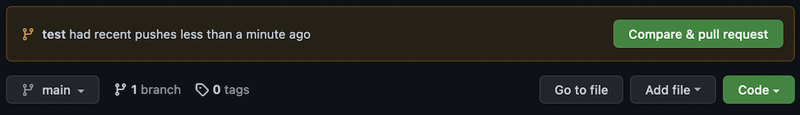
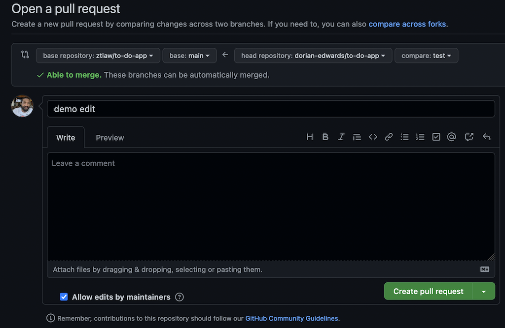

# Bank Study Questions

_Collaborative effort to cover commonly asked interview questions and brush up on fundamental web development and computer science concepts._

## How to contribute

[**_Fork this branch_**](https://github.com/dorian-edwards/study-questions)


<br>
<br>

Clone to your local machine ...


<br>
<br>

... by typing the following in your terminal in the directory where you want the folder

```bash
git clone [link here]
```

<br>
<br>
Create a new branch where you're going to work on changes by typing `git checkout -b [new branch name]`. This will automatically switch you to the branch after it's created.

```bash
git checkout -b my-changes
Switched to a new branch 'my-changes'
```

<br>
<br>
Once your changes are complete, added, and committed, push the changes upstream to your local copy of the repository

```bash
git push origin my-changes
```

<br>
<br>
You'll see that you can now submit a pull request to merge your new branch with edits/additions to the main branch of the forked repository.



<br>
<br>

Clicking this button will take you to another screen with additional details and the option to leave comments. Select create pull request in the botton right hand corner. From here, the owner or collaborators on the projects can review and merge your pull requests


